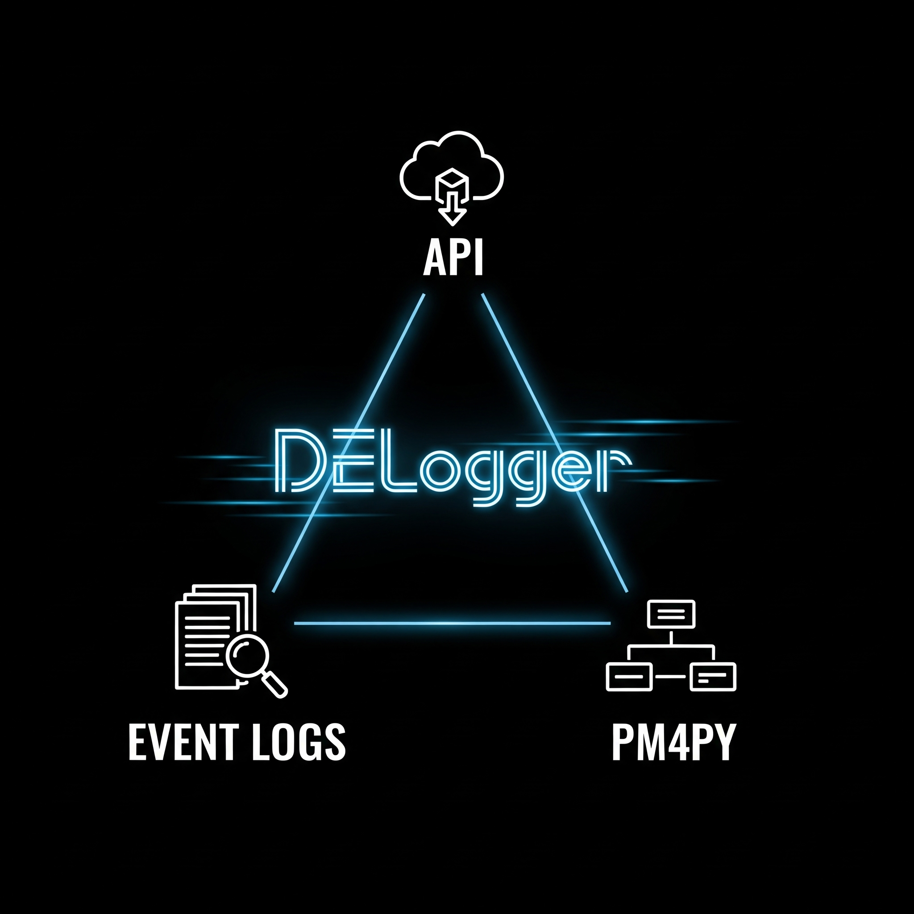

# devops-event-logger

This is not a data generator.
This tool uses existing apis provided in devops tools to create event logs which are suitable for process mining
Currently, event logs are only exported as pandas dataframes, in parquet.gz form.

## High level steps

- Create Personal Access Token (PATs) for devops tools desired (please see references below)
- Make sure requirements (provided in respective requirements.txt files) are satisfied.
- For windows, configure the windows_env_set.ps1, only the sections which need to be used. Run this file using powershell.
- For Linux or docker, configure same in env.list. When sourcing env.list in linux shell, quotes may need to be added.
- When building and running via docker container in linux, use the build.sh inside each folder (ex: gitlab/build.sh)
- you may want to adjust common/settings.json and common/logging.conf accordingly

## PATs and other data

- For gitlab PATs, please see this guide https://docs.gitlab.com/ee/user/profile/personal_access_tokens.html#create-a-personal-access-token
- For jira PATs, please see https://confluence.atlassian.com/enterprise/using-personal-access-tokens-1026032365.html
- To get gitlab repo ids, check the project settings, or click on the repo icon

## Tested / supported data sources

| DevOps system | Data sources | Tested Versions |
| ----------- | ----------- | ----------- |
| Jira | xml dump, v3 api based custom connector | jira cloud 2026 Aug version|
| Gitlab | python-gitlab | 16.x.x |
